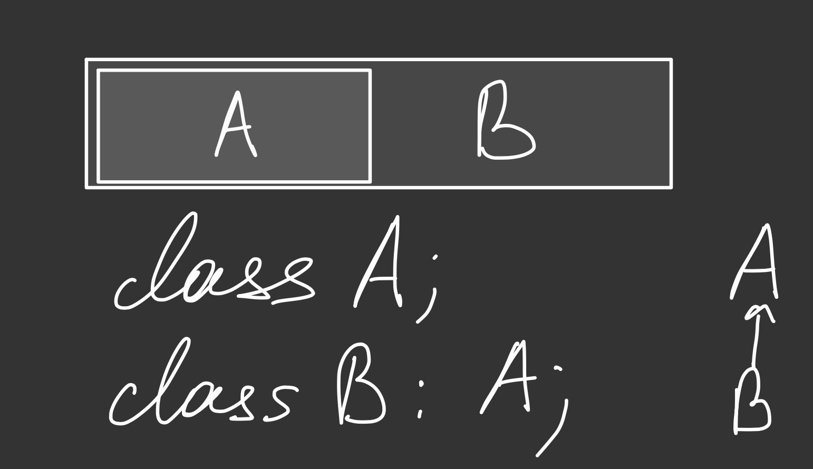
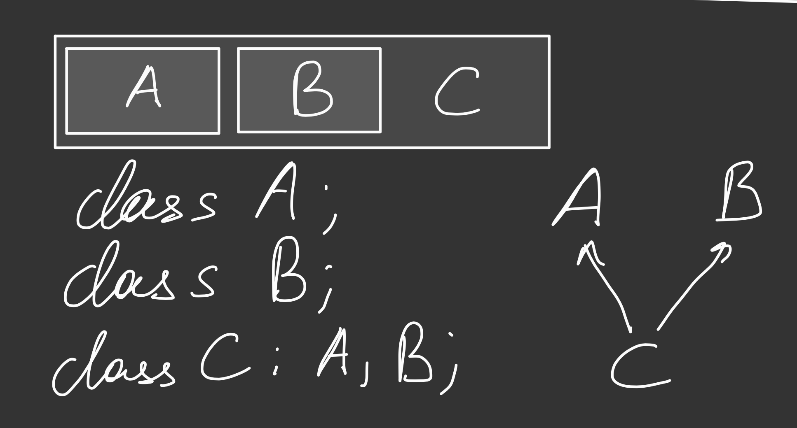
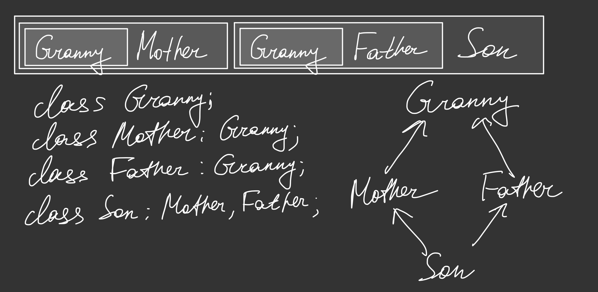
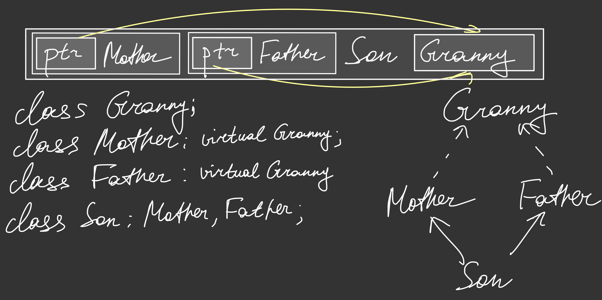
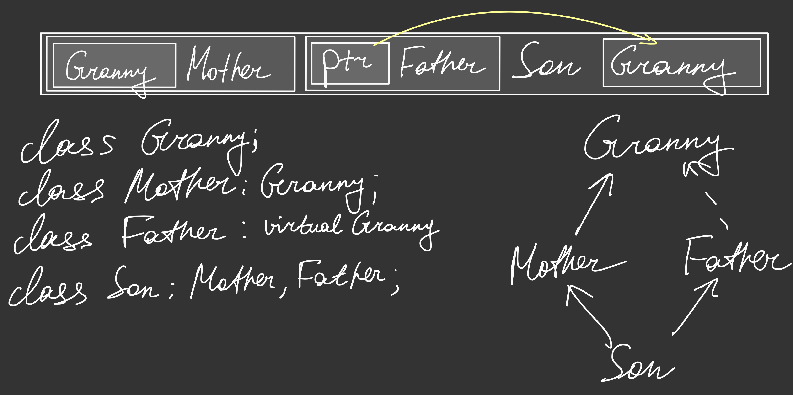

## Hometask 1
-----------

# TODO
* сделать задания 4-6

### Theory
#### Задача 1.
Как физически располагаются данные классов в памяти в случае одиночного и в случае множественного наследования? (1 балл)

------------

Ответ: 

> Одиночное наследование: они располагаются последовательно, т.е. если B - наследник A, то в памяти сначала целиком будет лежать объект типа A, затем собственные поля класса B



> Множественное наследование: они также в некотором смысле располагаются последовательно. Т.е. если Son - наследник Mother и Father, то в памяти сначала целиком будет лежать объекты типа Mother и Father, и только уже после них собственные поля класса Son



> В частности, в случае т.н. [ромбовидного наследования (diamond problem)](https://en.wikipedia.org/wiki/Multiple_inheritance#The_diamond_problem), т.е. в нашем конкретном случае, если и Mother, и Father наследуются от класса Granny, то в случае обычного наследования в памяти у Mother и Father будут свои копии Granny



#### Задача 2.
Что такое виртуальное наследование, к каким последствиям оно приводит? Как расположены данные в памяти? (1 балл)

------------

Ответ: 

> Виртуальное наследование - это наследование, позволяющее избавиться от копирования классов-предков в случаях вроде ромбовидного наследования

> Расположение в памяти примерно такое же за несколькими исключениями, а именно уже вышеупомянутым случаем ромбовидного наследования. Если во всех 3 наследованиях (Son -> Mother, Father; Mother -> Granny; Father -> Granny) все наследования к Granny виртуальными, то тогда в таком случае расположение в памяти будет (условно) примерно таким




> Т.е. мы получим, что класс Granny у нас встретится лишь один раз раз

> Однако в случае, если у нас есть как виртуальное, так и не виртуальное наследование к одному и тому же классу предку, то тогда а) все повторения виртуального предка сожмутся в один; б) каждый не-виртуальный предок останется как есть



> Минусы виртуального наследования:
> - Overhead связанный с реализацией в памяти наследования
> - Невозможность использовать static-cast или C-style cast
> - Сложность с точки зрения имллементации нетривиальных Copy/Move конструкторов (а тривиальных в стандарте [нет](https://timsong-cpp.github.io/cppwp/n4140/class.copy#25.1))
> - Конструкторы не могут быть помечены как constexpr

#### Задача 3.
Как физически работает преобразование указателя на потомка к указателю на предка в случае разных типов наследования? (1 балл)

------------

Ответ: 

> В случае обычного одиночного наследования указатель никак не меняется, из-за [расположения в памяти](#задача-1) объекта наследника, поэтому по сути указатель на начало объекта наследника сразу же и указывает и на начало предка

> Сложнее ситуация с множественным наследованием. В этом случае указатель может увеличиться, чтобы указывать на 2-ой, 3-ий и т.д. объекты классов предков (1-ый лежит в начале объекта наследника)

> Еще сложнее ситуация с ромбовидным наследованием. Т.к. объекта пред-предка по сути два, то если просто попытка получить доступ к Granny напрямую - это CE, поэтому приходится это делать черзе промежуточный класс.

```
Son s;
Granny& g = s; // Compilation error
Granny& g = static_cast<Mother&>(s); // получаем доступ к Granny в Mother
Granny& g = static_cast<Father&>(s); // получаем доступ к Granny в Father
```

------------

> В случае виртуального наследования ситуация аналогична с точностью до одной вещи: из-за виртуального наследования (условно) предок 2-ого уровня будет находится далеко от предка 1-ого уровня, поэтому он по сути будет сильно распределен по памяти (см. [задачу 2](#задача-2))

------------

#### Задача 4.
http://www.stolyarov.info/books/pdf/progintro_taskbook.pdf. Задача 10.10. (1 балл)

Ответ:
> Выведется следующее

```
first
third
result = (14 ; 3)
fourth
second
```

Объяснение:

> При создании класса наследника сначала должен полностью создаться класс предок. Кроме того, перед выполнением тела конструктора должны инициализироваться все поля класса. Поэтому, в целом порядок строки `B b;` такой:

 - Инициализация A::i без значения
 - Тело конструктора A: присваивание i = 0 и вывод строчки `first`
 - Тело конструктора B: вывод строчки `third`

> Вызов метода `b.f()` понятен - он происходит ровно так же, как бы и выводился в случае, если B не был бы ничьим наследником - вызвались именно его собственные (либо переопределенные виртуальные) методы

> Что происходит при вызове `p->f()`:

 - Т.к. p - указать на тип A, то вызывается функция f() из класса А, т.к. она не является виртуальной
 - По аналогичной причине берется i из класса A
 - По аналогичной причине функция `h()` из класса A, которая так же не является виртуальной
 - Во внутреннем вызове `g()` компилятор обнаруживает, что этот метод виртуальный, поэтому обращается в таблицу виртуальный функций у нашего указателя и обнаруживает, что это на самом деле указатель на класс типа `B` и вызывает функцию `g()` отсюда

> С деструктором происходит обратная по отношению к конструированию ситуация: сначала происходит удаление объекта наследника, его полей, затем класса предка и затем уже его полей. Поэтому в конце: 

 - Сначала выводится тело деструктора B
 - Затем выводится тело деструктора A
 

### Practice
#### Задача 5.
http://www.stolyarov.info/books/pdf/progintro_taskbook.pdf. Задача 10.12. (2 балла)

> [Код](./task1.5)

#### Задача 6.

> [Код](./task1.6)

Дан список операций на фондовом рынке, совершенных одним участником торгов. Об одной операции известно: ID операции, тип (buy, sell), ID акции, количество акций, цена одной акции. Необходимо написать программу, которая по заданному списку операций строит список сделок. 

> Сделка содержит следующую информацию: ID акции, количество акций, цена открытия сделки, цена закрытия сделки, полученная прибыль (отрицательное значение в случае убытка), ID операции открытия, ID операции закрытия. 

 - Для незакрытых сделок вместо цены закрытия и прибыли должно быть выдано "-". Сделки должны быть отсортированы по ID акции и ID операции закрытия. (2 балла)

 - Учесть два способа продажи: продается первая из купленных акций, либо продается последняя из купленных акций. (1 балл)

 - Учесть возможность открытия коротких позиций (когда участник продает акции, которых у него нет, потом покупает их обратно). (1 балл)

 - Если сделана корректная обработка коротких позиций, то в информацию о сделке необходимо добавить тип сделки (обычная или короткая).

 - Имя входного и выходного файлов, а также способ продажи задаются через аргументы командной строки.

--------
Пример входного файла:
```
1 buy Apple 10 150
2 buy Apple 5 140
3 sell Apple 5 145
4 sell Apple 15 155
5 buy Apple 15 135
```

Пример выходного файла (продается первая из купленных акций):
```
Apple 5 150 145 -25 long 1 3
Apple 5 150 155 25 long 1 4
Apple 5 140 155 75 long 2 4
Apple 5 155 135 100 short 4 5
Apple 10 135 - - long 5
```

Пример выходного файла (продается последняя из купленных акций):
```
Apple 5 140 145 25 long 2 3
Apple 10 150 155 50 long 1 4
Apple 5 155 135 100 short 4 5
Apple 10 135 - - long 5
```